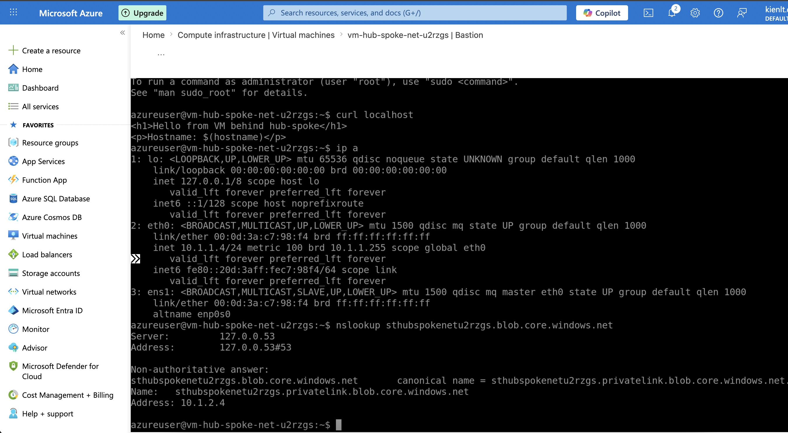

# Prepare

### Check provider registered

You may noticed `2>/dev/null`, it is just supposed to hide the warnings from python SDK.
```bash
az provider list --query "[?registrationState=='Registered'].namespace" -o tsv 2>/dev/null | sort
```

Required az provider
```bash
az provider list --query "[?registrationState=='Registered'].namespace" -o tsv 2>/dev/null | sort|grep -E "Microsoft.Network|Microsoft.Compute|Microsoft.Storage|Microsoft.OperationalInsights"
# Expected output
Microsoft.Compute
Microsoft.Network
Microsoft.OperationalInsights
Microsoft.Storage
```

If you not seeing thoses, please register by following commands:
```bash
az provider register --namespace Microsoft.Network
az provider register --namespace Microsoft.Compute
az provider register --namespace Microsoft.Storage
az provider register --namespace Microsoft.OperationalInsights
```

Or we can make a lazy way by edit 

```hcl
  provider "azurerm" {
    features {}
    subscription_id                 = var.subscription_id
    resource_provider_registrations = "core"  # auto-register các provider core (Network, Compute, Storage...)
  }
```

### Terraform

Init and make plan/apply:
```bash
terraform init
terraform plan -out=tfplan
terraform apply "tfplan"
```

It would take about 5-10 minutes ì ưe disable bastion and app-gateway. Expected output
```
Apply complete! Resources: 21 added, 0 changed, 0 destroyed.

Outputs:

log_workspace_name = "log-hub-spoke-net"
storage_account_name = "sthubspokenetu2rzgs"
storage_blob_pe_ip = "10.1.2.4"
vm_name = "vm-hub-spoke-net-u2rzgs"
vm_private_ip = "10.1.1.4"
vm_ssh_private_key_pem = <sensitive>
```

- 1. List Hub-spoke + peering
```bash
az network vnet peering list -g rg-hub-spoke-net --vnet-name vnet-hub-hub-spoke-net -o table
```

- 2. VM running
```bash
az vm list -g rg-hub-spoke-net -o table
Name                     ResourceGroup     Location
-----------------------  ----------------  -------------
vm-hub-spoke-net-u2rzgs  rg-hub-spoke-net  southeastasia
```

- 3. NSG(networkSecurityGroups) attaching into subnet
```bash
az network vnet subnet show -g rg-hub-spoke-net --vnet-name vnet-spoke-hub-spoke-net -n snet-vm --query networkSecurityGroup.id -o tsv
/subscriptions/your-subscription-id/resourceGroups/rg-hub-spoke-net/providers/Microsoft.Network/networkSecurityGroups/nsg-vm-hub-spoke-net
```

### Enable Bastion
- change to `enable_bastion     = true`

Expected output:
```
Apply complete! Resources: 2 added, 0 changed, 0 destroyed.

Outputs:

bastion_name = "bas-hub-spoke-net"
log_workspace_name = "log-hub-spoke-net"
storage_account_name = "sthubspokenetu2rzgs"
storage_blob_pe_ip = "10.1.2.4"
vm_name = "vm-hub-spoke-net-u2rzgs"
vm_private_ip = "10.1.1.4"
vm_ssh_private_key_pem = <sensitive>
```

Oke, connect to it via Azure Portal → VM vm-hub-spoke-net-xxx → Connect → Bastion. Username azureuser. SSH Private Key select from this file:
```bash
terraform output -raw vm_ssh_private_key_pem > ~/Desktop/vm.pem
```

Inside VM:

```bash
curl http://localhost # Return landing page
ip a # Return ip of this VM
nslookup <storage_account_name>.blob.core.windows.net # return ip Storage account IP
```

A picture for easy imagination:




