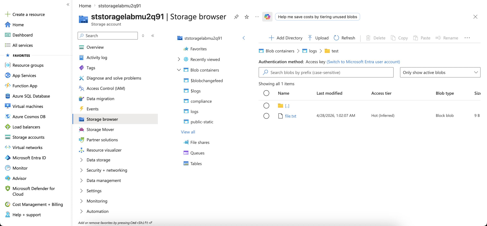

### Tutorial

```bash
cd projects/07-storage-deepdive/azure/terraform
az login --use-device-code
cp terraform.tfvars.example terraform.tfvars
terraform init
terraform plan -out=tfplan
terraform apply "tfplan"
# Apply complete! Resources: 8 added, 0 changed, 0 destroyed.
```

### File layout

```
azure/terraform/
├── providers.tf            # azurerm 4.x, key=storage-deepdive.tfstate
├── variables.tf, locals.tf
├── main.tf                 # RG + suffix
├── storage.tf              # SA với versioning + soft delete + role assign
├── containers.tf           # 3 containers (private, blob, compliance)
├── lifecycle.tf            # 2 rules: logs/ tier-down, public/ keep hot
├── sas.tf                  # Read-only SAS data source cho container logs
├── outputs.tf
└── terraform.tfvars.example
```

### Verify

```bash
SA=$(terraform output -raw storage_account_name)

# 1. Versioning + soft delete
az storage account blob-service-properties show \
  --account-name $SA --query "{ver:isVersioningEnabled, sd:deleteRetentionPolicy.enabled, csd:containerDeleteRetentionPolicy.enabled}" -o jsonc

# Expect: {"ver": true, "sd": true, "csd": true}

# 2. Lifecycle policy
az storage account management-policy show --account-name $SA -g rg-storage-lab --query policy.rules -o jsonc

# 3. SAS URL works
curl "$(terraform output -raw logs_sas_url)&restype=container&comp=list" | head -c 400
```

### Step 2 — Soft delete recovery


1. Upload + delete + recover
```bash
echo "hello v1" > /tmp/file.txt
az storage blob upload \
  --account-name $SA \
  --container-name logs \
  --name test/file.txt \
  --file /tmp/file.txt \
  --auth-mode login
```

Verify 

2. Delete it
```bash
az storage blob delete \
  --account-name $SA \
  --container-name logs \
  --name test/file.txt \
  --auth-mode login
```

3. List versions + deleted state

> **Lưu ý**: container có **versioning enabled** + **soft delete enabled** đồng thời. Khi versioning ON, delete tạo **delete marker** (version mới), không đẩy blob vào soft-delete state. Phải `--include vd` để thấy đủ.

```bash
az storage blob list \
  --account-name $SA \
  --container-name logs \
  --include vd \
  --auth-mode login \
  --prefix test/file.txt \
  --query "[].{name:name, version:versionId, current:isCurrentVersion, deleted:deleted}" \
  -o table
# Expect: 2 rows
#   current=True  → delete marker (blob "đã xoá")
#   current=False → version cũ còn nguyên
```

> **Pattern AZ-104**: container chỉ có soft delete (không versioning) → `az storage blob undelete` direct. Có versioning → version copy. Exam hay hỏi *"Container có cả 2 setting → recover blob đã xoá thế nào?"* → answer là version copy.

### Cleanup

```bash
terraform destroy
# Nếu container `compliance` có locked immutability → unlock manually trước
```
