# Roadmap
  ┌─────┬────────────────────────────┬───────────────────────────────────────────────┬────────────────────────────────────────────────────┐
  │  #  │            Step            │                    Tạo gì                     │                        Why                         │
  ├─────┼────────────────────────────┼───────────────────────────────────────────────┼────────────────────────────────────────────────────┤
  │ 1   │ Resource Group             │ rg-jump-host-manual                           │ Cái thùng chứa tất cả, để xoá 1 phát là sạch       │
  ├─────┼────────────────────────────┼───────────────────────────────────────────────┼────────────────────────────────────────────────────┤
  │ 2   │ Virtual Network + 2 Subnet │ vnet-jump, snet-bastion, snet-private         │ Cái "mạng LAN ảo" của bro trên cloud               │
  ├─────┼────────────────────────────┼───────────────────────────────────────────────┼────────────────────────────────────────────────────┤
  │ 3   │ NSG cho bastion            │ nsg-bastion (allow SSH từ IP nhà bro)         │ Firewall lớp 1 — chặn cả thế giới, chỉ chừa IP nhà │
  ├─────┼────────────────────────────┼───────────────────────────────────────────────┼────────────────────────────────────────────────────┤
  │ 4   │ NSG cho private            │ nsg-private (allow SSH chỉ từ subnet bastion) │ Firewall lớp 2 — defense-in-depth                  │
  ├─────┼────────────────────────────┼───────────────────────────────────────────────┼────────────────────────────────────────────────────┤
  │ 5   │ Bastion VM                 │ vm-bastion + Public IP                        │ Cái "cổng" duy nhất ra Internet                    │
  ├─────┼────────────────────────────┼───────────────────────────────────────────────┼────────────────────────────────────────────────────┤
  │ 6   │ Workload VM                │ vm-app1 (KHÔNG public IP)                     │ Cái VM thật chạy app, ẩn sau bastion               │
  ├─────┼────────────────────────────┼───────────────────────────────────────────────┼────────────────────────────────────────────────────┤
  │ 7   │ Test SSH ProxyJump         │ ssh -J bastion vm-app1                        │ Verify model hoạt động                             │
  ├─────┼────────────────────────────┼───────────────────────────────────────────────┼────────────────────────────────────────────────────┤
  │ 8   │ Cleanup                    │ Xoá resource group                            │ Tránh đốt tiền                                     │
  └─────┴────────────────────────────┴───────────────────────────────────────────────┴────────────────────────────────────────────────────┘

Let's fucking GO!

# Step 1: create Resource Group (RG)
Everything you created (vm, network, ip ....) is contained under 1 (RG). So when you delete RG, everything inside it deleted!

Resource groups in Azure themselves do not incur any costs. They are essentially a logical container used to manage and organize related resources for an Azure solution. However, while the resource group itself is free, the resources within the group, such as virtual machines, databases, or storage accounts, may have associated costs based on their usage and pricing.

Ok, so let's create RG like this fucking picture

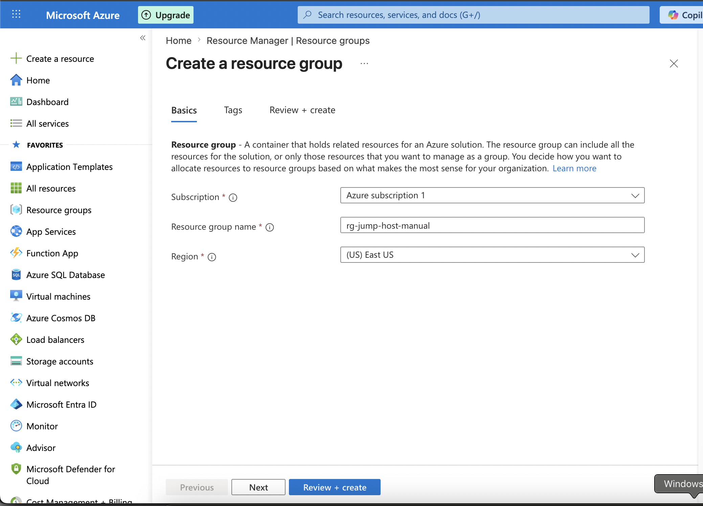

Make some pre-defined tags and create

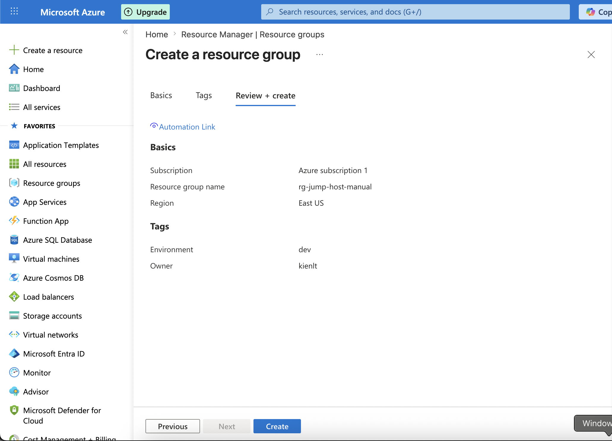

Ok, verify by Azure CLI:
```bash
projects % az group list -o table

Name                           Location       Status
-----------------------------  -------------  ---------
rg-jump-host-manual            eastus         Succeeded
```

# Step 2: Create virtual network + 2 subnet
Concept: VNet (Virtual Network)

Subnet = Divive VNet to multiple tier. Each subnet have it's own ip + can attach it's own NSG (network secgroup). So we divive this this into 2 subnet for this fucking lab!

- snet-bastion (10.50.0.0/24): contain bastion, have public ip and able to ssh from internet
- snet-private (10.50.1.0/24): contain workload VMs, have no fucking public ip and NSG only allow ssh from bastion subnet

Create VNet like this way:

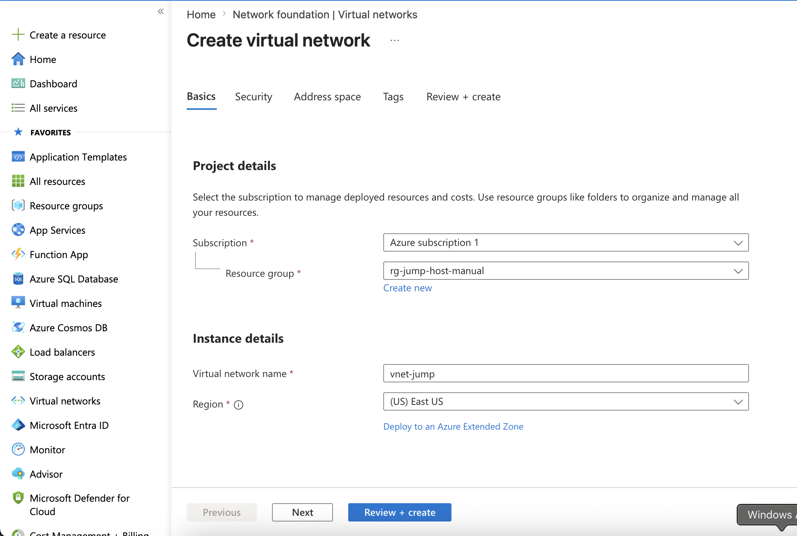

Skip everything in tab `security`. Then in next tab, update address space to `10.50.0.0/16`, delete `default` subnet 
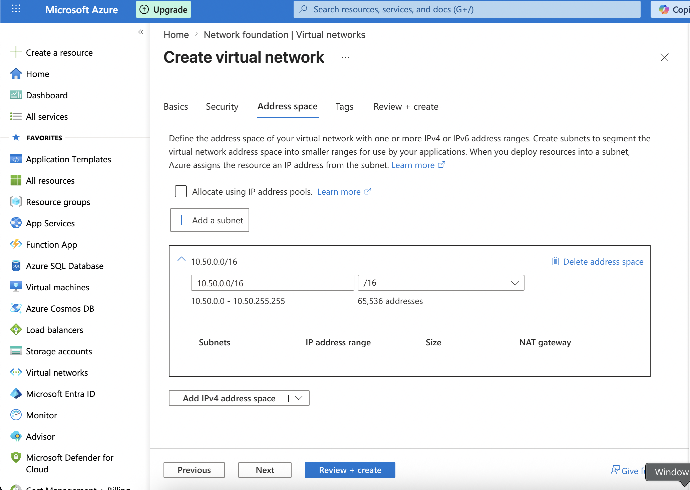

then click into `Add a subnet` with following info, rest leave default.

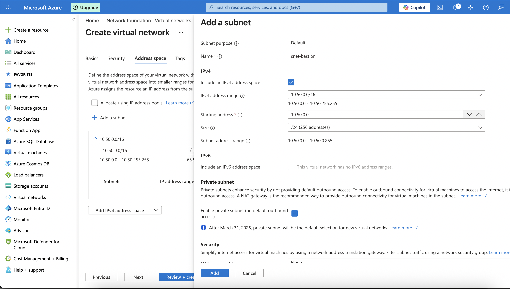

Add a second subnet with following into

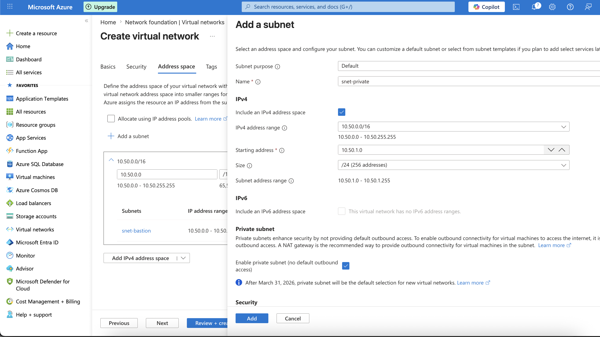


Next skip tag or type whatever you want. Then create with following information

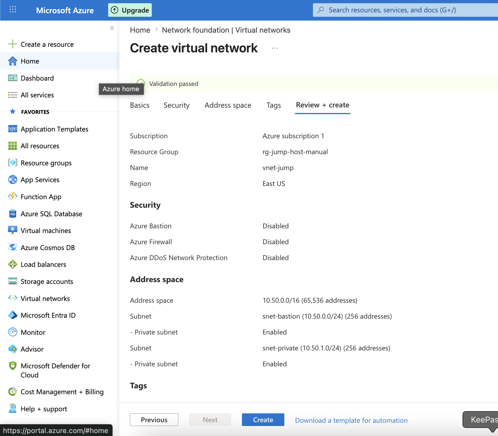

Validate with Azure CLI: 
```bash
az network vnet subnet list -g rg-jump-host-manual --vnet-name vnet-jump -o table
DefaultOutboundAccess    Name          PrivateEndpointNetworkPolicies    PrivateLinkServiceNetworkPolicies    ProvisioningState    ResourceGroup
-----------------------  ------------  --------------------------------  -----------------------------------  -------------------  -------------------
False                    snet-bastion  Disabled                          Enabled                              Succeeded            rg-jump-host-manual
False                    snet-private  Disabled                          Enabled                              Succeeded            rg-jump-host-manual
```

# Step 3: NSG for bastion subnet

NSG (Network Security Group) = stateful firewall of Azure. Stateful in this scenario meaning if allow 1 inbound connection, traffic outbound of that connection allow by default, no need to manually create outbound rule.

NSG can be attach into 2 level:
- `Subnet level`: cover whole subnet, easy to management.
- `NIC level`: attach into NIC of VM

Priority: rule have priority from 100-4096, lowest win. When we have incomming packet Azure browsing rule from lower to higher. Matched first Allow/Deny then stop.

There are some default rule by Azure, can not delete:
- AllowVNetInBound: allow between VNet <--> VNet
- AllowAzureLoadBalancerInBound: health probe of LB (Load Balancer)
- DenyAllInBound: deny by default.

So for example, you only need to allow port 22 to bastion, no need to deny other because Azure deny inbound connection by default. Ok let's find in search bar `Network security groups` or `Virtual Network` -> `Network security groups`. I will skip tags for this lab.

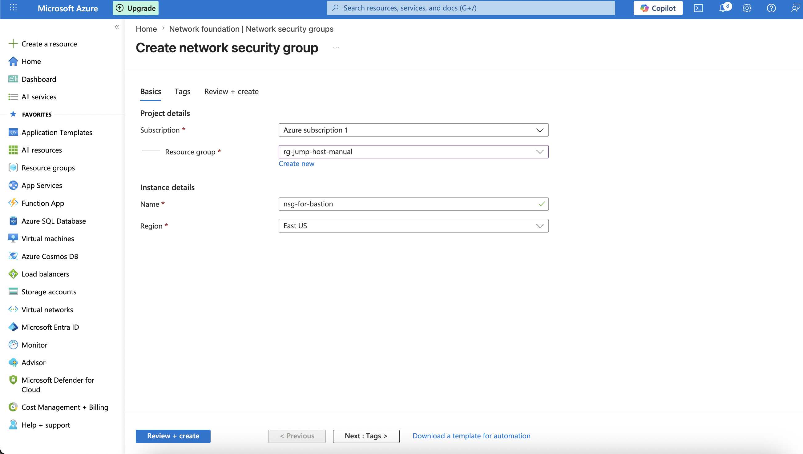

After create, enter NSG resource detail

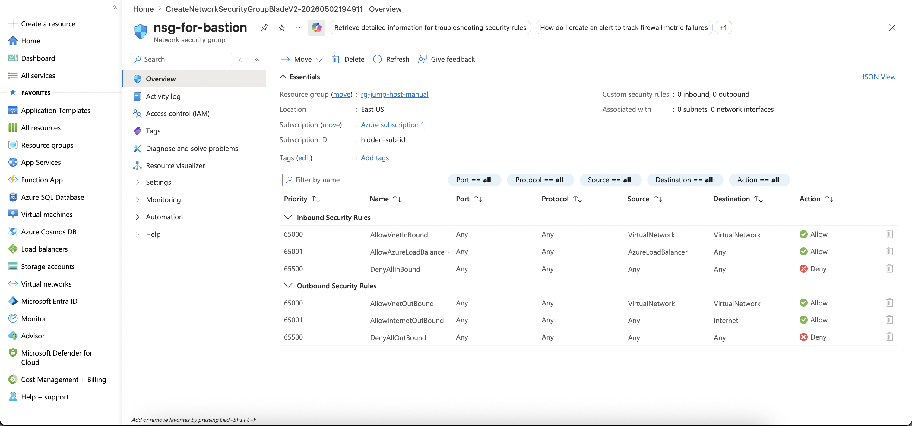

Add new inbound rule by click like this --> Add button

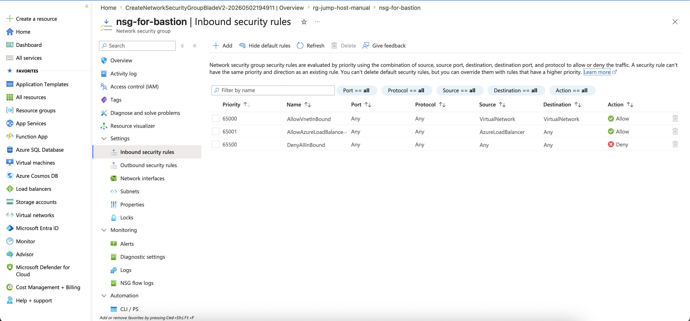

Rest is too basic, you know what to do! Demo output

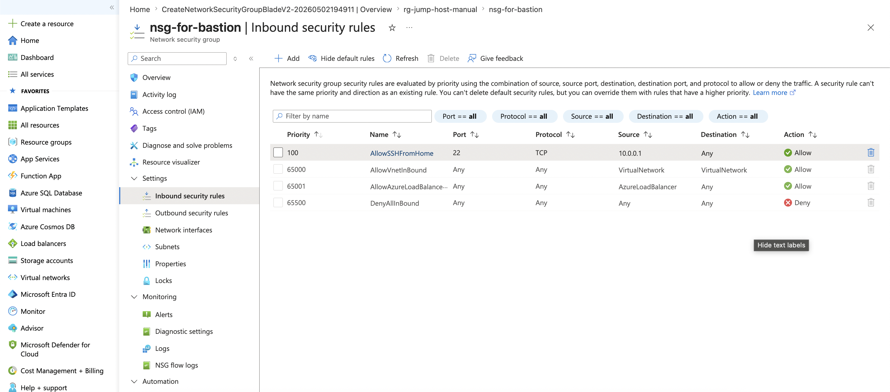

**Here is fucking important step: Associate NSG vào subnet**

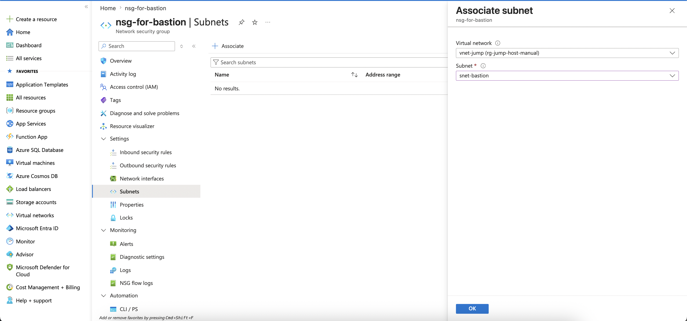

Verify cli Azure CLI: 

- Rule list: `az network nsg rule list -g rg-jump-host-manual --nsg-name nsg-for-bastion --include-default -o table`

- Subnet associations: `az network nsg show -g rg-jump-host-manual -n nsg-for-bastion --query "subnets[].id" -o tsv`

# Step 4: Create NSG for private subnet

Second NSG, we gonna allow all ssh access (22) to any VM in snet-private from bastion.

Create NSG for snet-private

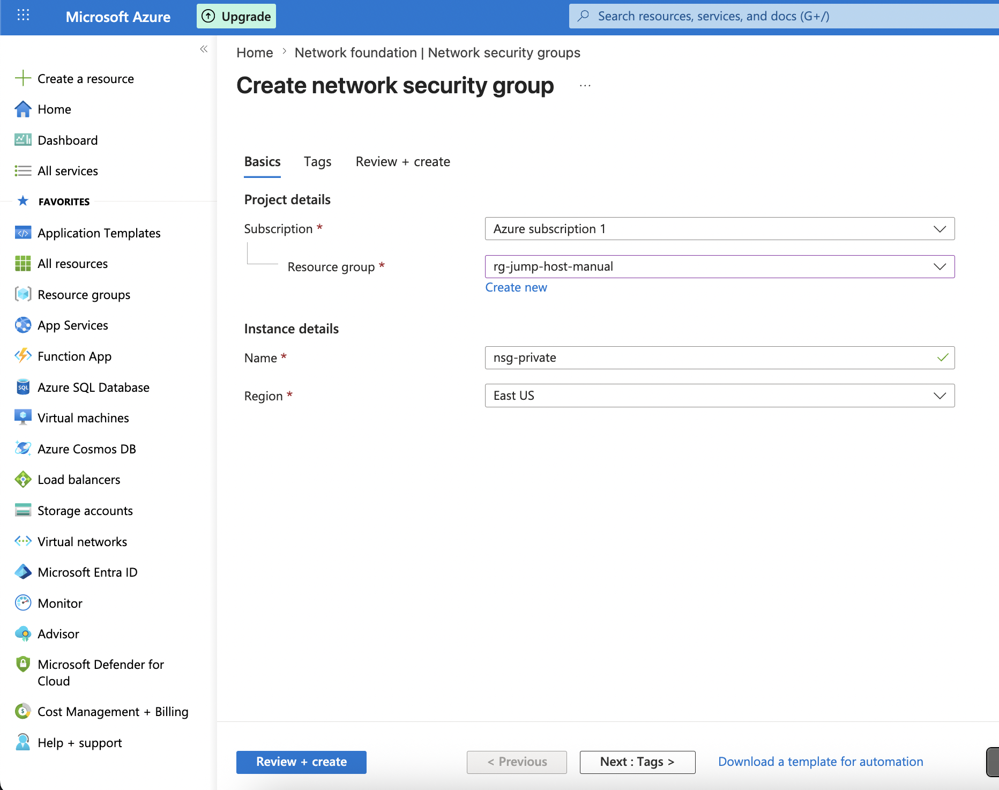

Enter NSG `nsg-private` create 2 rules:

- Allow SSH from bastion subnet, image is wrong, `10.50.0.0/24` is correct CIDR range need to allow (allow from bastion to private in snet-private)

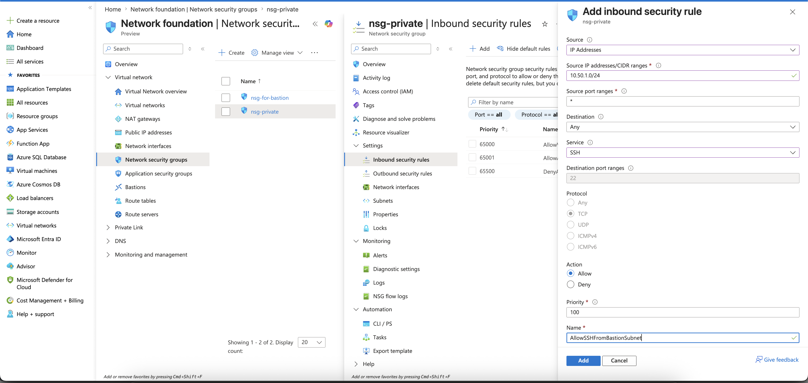

- Second rule is allow port 80 for demo example from snet-private to snet-bastion

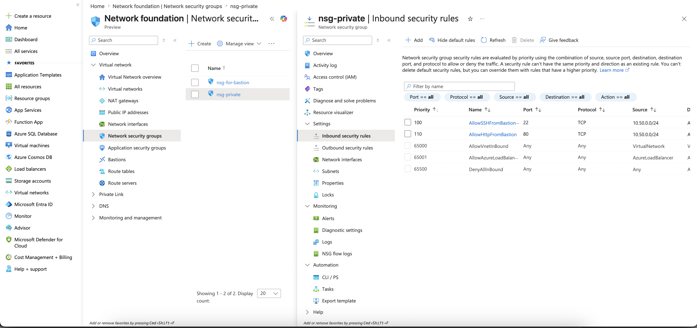

- Associate snet-private NSG into snet-private

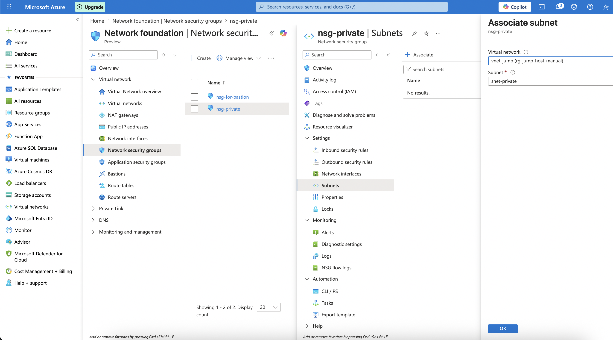

- Verify by: `az network nsg rule list -g rg-jump-host-manual --nsg-name nsg-private -o table`. You will see 2 rule applied into this secGroup.

-  View list of subnet associate with VNet

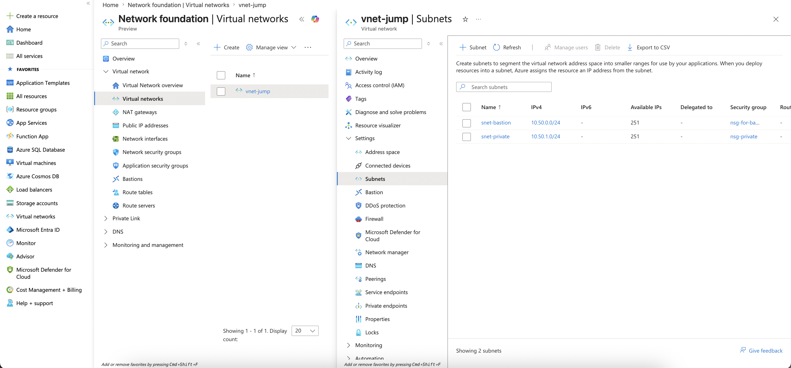

- Conclusion: Create 1 vnet with 2 subnet, create 2 nsg, assign them into 2 subnet created.

# Step 5: Create VM

You probably getting fucked up like me. Just create whatever fucking available with lowest cpu core for this fucking LAB.

So just pick up spec `DC1ds_v3` for bastion. And for second vm for workload in snet-private, use with Azure CLI:
```bash
az vm create \
    --resource-group rg-jump-host-manual \
    --name vm-app1 \
    --location eastus \
    --image Ubuntu2404 \
    --size Standard_DC1ds_v3 \
    --vnet-name vnet-jump \
    --subnet snet-private \
    --nsg "" \
    --public-ip-address "" \
    --admin-username azureuser \
    --ssh-key-values ~/.ssh/id_ed25519.pub \
    --storage-sku Standard_LRS \
    --os-disk-size-gb 30 \
    --tags Project=jump-host Owner=kien Role=workload
```

Expected output:
```json
{
  "fqdns": "",
  "id": "/subscriptions/sub-id/resourceGroups/rg-jump-host-manual/providers/Microsoft.Compute/virtualMachines/vm-app1",
  "location": "eastus",
  "macAddress": "38-33-C5-F0-4A-11",
  "powerState": "VM running",
  "privateIpAddress": "10.50.1.4",
  "publicIpAddress": "",
  "resourceGroup": "rg-jump-host-manual"
}
```

Ok, verify it:
```bash
az vm list -g rg-jump-host-manual  -o table
Name        ResourceGroup        Location
----------  -------------------  ----------
vm-app1     rg-jump-host-manual  eastus
vm-bastion  rg-jump-host-manual  eastus
```

SSH Config
```
# Azure temp demo
Host vm-bastion
  HostName public-ip-here-bro
  User azureuser
  IdentityFile ~/.ssh/id_ed25519
  StrictHostKeyChecking no

Host vm-app1
  HostName 10.50.1.4
  User azureuser
  IdentityFile ~/.ssh/id_ed25519
  ProxyJump vm-bastion
  StrictHostKeyChecking no
```

Expected output when: `ssh vm-app1`

```
ssh vm-app1
Warning: Permanently added '10.50.1.4' (ED25519) to the list of known hosts.
Welcome to Ubuntu 24.04.4 LTS (GNU/Linux 6.17.0-1011-azure x86_64)
...............
azureuser@vm-app1:~$
```