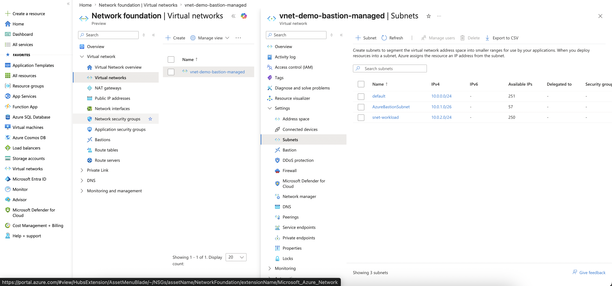
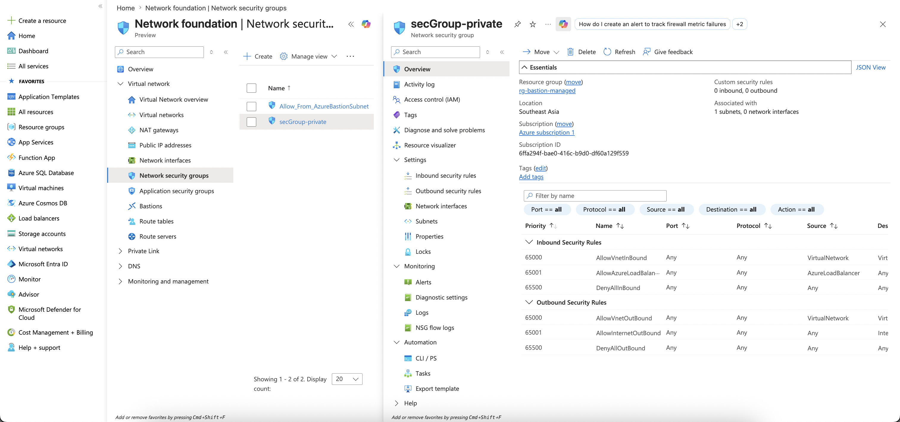

# Managed Bastion

First: it is fucking expensive...
Second: Fuck, still too expensive!!!

Ok, I created managed bastion and `snet-workload` subnet



And ofc, 2 VM in `snet-workload` subnet
```bash
az vm create \
    --resource-group rg-bastion-managed \
    --name vm-app1 \
    --location southeastasia \
    --image Ubuntu2404 \
    --size Standard_DC1ds_v3 \
    --vnet-name vnet-demo-bastion-managed \
    --subnet snet-workload \
    --nsg "" \
    --public-ip-address "" \
    --admin-username azureuser \
    --ssh-key-values ~/.ssh/id_ed25519.pub \
    --storage-sku Standard_LRS \
    --os-disk-size-gb 30 \
    --tags Project=jump-host Owner=kien Role=workload

az vm create \
    --resource-group rg-bastion-managed \
    --name vm-app2 \
    --location southeastasia \
    --image Ubuntu2404 \
    --size Standard_DC1ds_v3 \
    --vnet-name vnet-demo-bastion-managed \
    --subnet snet-workload \
    --nsg "" \
    --public-ip-address "" \
    --admin-username azureuser \
    --ssh-key-values ~/.ssh/id_ed25519.pub \
    --storage-sku Standard_LRS \
    --os-disk-size-gb 30 \
    --tags Project=jump-host Owner=kien Role=workload
```

And yeah, NSG applied to `snet-workload` subnet



At the first time, I have no idea why I'm able to ssh without secGroup rule xD. But default rule `AllowVnetInBound` did it already, not good for production, but it's ok for this fucking lab. 
Production fix: add explicit DenyVnetInBound priority < 65000, then add specific Allow rules for needed ports. Otherwise any compromised VM in VNet can hit any port on any other VM.

Ok. Time to SSH via bastion. Note: `az network bastion ssh` requires Standard SKU (or Premium). Basic SKU only allows browser HTML5. Upgrade via Bastion → Configuration → Tier → Standard.
```bash
az network bastion ssh \
  --name vnet-demo-bastion-managed-Bastion \
  --resource-group rg-bastion-managed \
  --target-resource-id $(az vm show -g rg-bastion-managed -n vm-app1 --query id -o tsv) \
  --auth-type ssh-key \
  --username azureuser \
  --ssh-key ~/.ssh/id_ed25519
```

Sudo then stuck with `apt update`? By default, our VM doesn't have fucking Internet Egress, that is why fucking `apt update` stuck. 

What we need to do?

### Create Public IP for NAT Gateway
```bash
az network public-ip create \
  -g rg-bastion-managed \
  -n pip-natgw \
  --location southeastasia \
  --sku Standard \
  --allocation-method Static
```

### Create NAT Gateway

List all subnet first to make sure we are not choosing wrong subnet for our NAT Gateway
```bash
az network vnet subnet list \
-g rg-bastion-managed \
--vnet-name vnet-demo-bastion-managed \
--query "[].{Name:name, CIDR:addressPrefixes[0]}" -o table
```

Expected output
```
Name                CIDR
------------------  -----------
default             10.0.0.0/24
AzureBastionSubnet  10.0.1.0/26
snet-workload       10.0.2.0/24
```

Ok, we have the right name `snet-workload`. Create NAT Gateway:
```bash
az network nat gateway create \
  -g rg-bastion-managed \
  -n natgw-workload \
  --location southeastasia \
  --public-ip-addresses pip-natgw \
  --idle-timeout 10
```

### Attach NAT Gateway into snet-workload subnet
```bash
az network vnet subnet update \
  -g rg-bastion-managed \
  --vnet-name vnet-demo-bastion-managed \
  -n snet-workload \
  --nat-gateway natgw-workload
```

So what does it means? it means any VM under `snet-workload` will have internet access with public ip from `pip-natgw`

Example:
```bash
root@vm-app2:~# curl ifconfig.me && echo
104.215.188.121
root@vm-app1:~# curl ifconfig.me && echo
104.215.188.121
```

### Cleanup

```bash
az group delete -n rg-bastion-managed --no-wait --yes
```