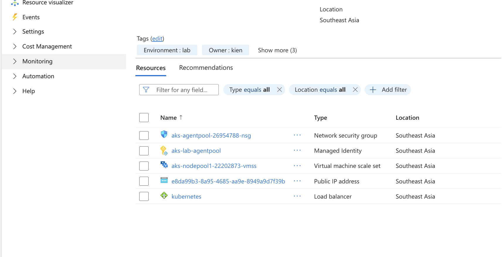
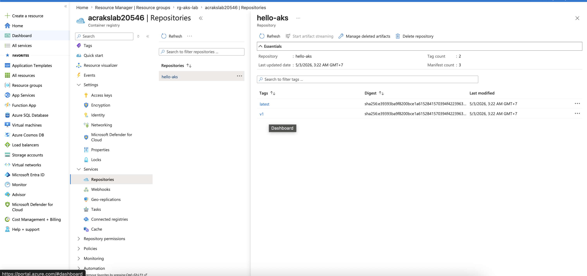

# Architecture target

  laptop (kubectl)
     │ HTTPS port 443 (kubectl API)
     │ allowlist IP
     ▼
  ┌─ Internet ─┐
  └─────┬──────┘
        ▼
  ┌─ AKS API Server (managed by Azure) ─┐
  │ Control plane: free tier, no node    │
  └────────────┬─────────────────────────┘
               │ kubelet, image pull
               ▼
  ┌─ snet-aks (10.10.1.0/24) ─────────────┐
  │  AKS node (Standard_D2s_v3, 2 vCPU)    │
  │  ├─ kube-system pods                   │
  │  └─ user pods (nginx demo)             │
  └────────────┬───────────────────────────┘
               │ image pull qua managed identity
               ▼
  ┌─ ACR (Basic SKU) ──────────────────────┐
  │ Đăng ký image, AKS auth qua ACR role   │
  └────────────────────────────────────────┘

  Internet ──▶ Standard Load Balancer (auto tạo bởi AKS Service type=LoadBalancer)
                       │
                       ▼
               Pod nginx (cluster IP)

---

# CIDR plan:
VNet:        10.10.0.0/16    (bro tránh trùng với lab cũ 10.0.x.x, 10.50.x.x)
snet-aks:    10.10.1.0/24    (256 IPs, dư cho 1 node + LB IP)
Pod overlay: 10.244.0.0/16   (default Overlay range, không tốn IP subnet)
Service CIDR: 10.0.0.0/16    (default K8s service range, internal cluster)

# Create Resources

### Step 1: Resource Group
```bash
az group create -n rg-aks-lab -l southeastasia --tags Project=aks-lab Owner=kien Environment=lab
```

### Step 2: Create VNet + subnet AKS
```bash
az network vnet create \
-g rg-aks-lab \
-n vnet-aks \
--location southeastasia \
--address-prefix 10.10.0.0/16 \
--subnet-name snet-aks \
--subnet-prefix 10.10.1.0/24 \
--tags Project=aks-lab Owner=kien Environment=lab
```

Verify:
```bash
az network vnet subnet list \
    -g rg-aks-lab \
    --vnet-name vnet-aks \
    --query "[].{Name:name, CIDR:addressPrefix}" -o table
# Expected output
Name      CIDR
--------  ------------
snet-aks  10.10.1.0/24
```

Save subnet id:
```bash
export SUBNET_ID=$(az network vnet subnet show \
    -g rg-aks-lab \
    --vnet-name vnet-aks \
    -n snet-aks \
    --query id -o tsv)
```

### Step 3: Create ACR
Generate unique name:
```bash
ACR_NAME="acrakslab$RANDOM"
echo "ACR name will be: $ACR_NAME"
# ACR name will be: acrakslab20546
```

Create ACR Basic:
```bash
az acr create \
    -g rg-aks-lab \
    -n $ACR_NAME \
    --sku Basic \
    --location southeastasia \
    --tags Project=aks-lab Owner=kien Environment=lab
```

Show ACR Info:
```bash
az acr show -n $ACR_NAME \
    --query "{name:name, loginServer:loginServer, sku:sku.name, status:provisioningState}" \
    -o jsonc
```

Expected output:
```json
{
  "loginServer": "acrakslab20546.azurecr.io",
  "name": "acrakslab20546",
  "sku": "Basic",
  "status": "Succeeded"
}
```

For Login later:
```bash
export ACR_NAME=$ACR_NAME
export ACR_LOGIN_SERVER=$(az acr show -n $ACR_NAME --query loginServer -o tsv)
```

Test login container registry:
```bash
az acr login -n $ACR_NAME
# Login Succeeded
```

### Step 4: Create AKS

Make sure Microsoft.ContainerService registered for subscription
```bash
az provider register --namespace Microsoft.ContainerService
az provider register --namespace Microsoft.ContainerRegistry
```

Verify:
```bash
az provider show -n Microsoft.ContainerService --query registrationState -o tsv
```

Get your public IP:
```bash
MYIP=$(curl -s https://api.ipify.org)
```

Create AKS command:
```bash
az aks create \
    --resource-group rg-aks-lab \
    --name aks-lab \
    --location southeastasia \
    --tier free \
    --kubernetes-version 1.35.0 \
    --node-count 1 \
    --node-vm-size Standard_D2s_v3 \
    --vnet-subnet-id $SUBNET_ID \
    --network-plugin azure \
    --network-plugin-mode overlay \
    --pod-cidr 10.244.0.0/16 \
    --service-cidr 10.20.0.0/16 \
    --dns-service-ip 10.20.0.10 \
    --enable-managed-identity \
    --attach-acr $ACR_NAME \
    --api-server-authorized-ip-ranges $MYIP/32 \
    --generate-ssh-keys \
    --tags Project=aks-lab Owner=kien Environment=lab
```

If there something fucked up related to version of k8s: `az aks get-versions -l southeastasia` try to change to other version (latest for example!). It will tooks about 5-10 minutes

Verify:
```bash
az aks show -g rg-aks-lab -n aks-lab \
    --query "{name:name, state:provisioningState, k8s:kubernetesVersion}" \
    -o jsonc
# Expected output
{
  "k8s": "1.35.0",
  "name": "aks-lab",
  "state": "Succeeded"
}
```

Cluster Info:
```json
az aks show -g rg-aks-lab -n aks-lab \
    --query "{name:name, fqdn:fqdn, k8s:kubernetesVersion, nodeRG:nodeResourceGroup, identity:identity.type}" \
    -o jsonc
# Output
{
  "fqdn": "aks-lab-rg-aks-lab-6ffa29-svgtoxzi.hcp.southeastasia.azmk8s.io",
  "identity": "SystemAssigned",
  "k8s": "1.35.0",
  "name": "aks-lab",
  "nodeRG": "MC_rg-aks-lab_aks-lab_southeastasia"
}
```

Note: AKS auto created 1 RG named MC_<rg>_<aks>_<region> that contains VM, NSG, LB, Public IP. Don't touch this fucking RG, AKS will delete this auto when we delete AKS

Check role assignment in ACR:
```bash
ACR_ID=$(az acr show -n $ACR_NAME --query id -o tsv)
az role assignment list --scope $ACR_ID -o table | grep AcrPull
# Output
.....Microsoft.ContainerRegistry/registries/acrakslab20546
```

In scenario `--attach-acr` not working: `az aks update -g rg-aks-lab -n aks-lab --attach-acr $ACR_NAME`

Verify:
```bash
az aks get-credentials -g rg-aks-lab -n aks-lab
# Merged "aks-lab" as current context in /Users/kienlt/.kube/config
# kctx installed here: https://github.com/BlackMetalz/ChgK8sCtx
kctx
# Using default kubeconfig path: /Users/kienlt/.kube/config
# ✔ aks-lab(current-context)
# You already selected this context!
k get nodes
# NAME                                STATUS   ROLES    AGE     VERSION
# aks-nodepool1-22202873-vmss000000   Ready    <none>   7m23s   v1.35.0
```




### Step 5: kubectl + ACR build/push

CD into `cd projects/10-ecr-aks/aks-lab-app`

Build local because `az acr build` will not work on trial subscription
```bash 
az acr login -n $ACR_NAME
# Login Succeeded
  docker buildx build \
    --platform linux/amd64,linux/arm64 \
    --tag $ACR_LOGIN_SERVER/hello-aks:v1 \
    --tag $ACR_LOGIN_SERVER/hello-aks:latest \
    --push \
    .
```

Verify `az acr repository show-tags -n $ACR_NAME --repository hello-aks -o table`
```
Result
--------
latest
v1
```

Via portal


### Step 6: Deploy APP into AKS

Apply it: 
```bash
pwd
# projects/10-ecr-aks/aks-lab-app
k apply -f deploy.yaml
```

Output:
```bash
k get pod -owide
NAME                        READY   STATUS    RESTARTS   AGE   IP             NODE                                NOMINATED NODE   READINESS GATES
hello-aks-58d5fbc6b-8krf4   1/1     Running   0          24s   10.244.0.155   aks-nodepool1-22202873-vmss000000   <none>           <none>
hello-aks-58d5fbc6b-gqxrz   1/1     Running   0          26s   10.244.0.167   aks-nodepool1-22202873-vmss000000   <none>           <none>
hello-aks-58d5fbc6b-j2qdl   1/1     Running   0          22s   10.244.0.132   aks-nodepool1-22202873-vmss000000   <none>           <none>
```

### Step 7 — Expose app via LoadBalancer Service (We can skip this section)

Apply service type loadbalancer: `k apply -f svc.yaml`

Output:
```bash
k get svc
NAME         TYPE           CLUSTER-IP      EXTERNAL-IP     PORT(S)        AGE
hello-aks    LoadBalancer   10.20.112.185   11.111.11.111   80:32420/TCP   66m
kubernetes   ClusterIP      10.20.0.1       <none>          443/TCP        93m
```

Verify Azure resource created:
- Public IP for LoadBalancer in nodeRG: 
```bash
az network public-ip list \
    -g MC_rg-aks-lab_aks-lab_southeastasia \
    --query "[].{name:name, ip:ipAddress, sku:sku.name}" -o table
# output (2 rows)
Name                                         Ip             Sku
-------------------------------------------  -------------  --------
```

- Standard LB:
```bash
az network lb list \
    -g MC_rg-aks-lab_aks-lab_southeastasia \
    --query "[].{name:name, sku:sku.name, frontends:frontendIpConfigurations[].name}" -o table

Name        Sku
----------  --------
kubernetes  Standard
```

Get external IP to test: `EXTERNAL_IP=$(kubectl get svc hello-aks -o jsonpath='{.status.loadBalancer.ingress[0].ip}')`

Testing time:
```bash
for i in {1..6}; do
    echo "--- Request $i ---"
    curl -s http://$EXTERNAL_IP | grep "pod\">" | sed 's/<[^>]*>//g'
  done
--- Request 1 ---
hello-aks-7fd4ff6c4f-lgt2w
--- Request 2 ---
hello-aks-7fd4ff6c4f-lgt2w
--- Request 3 ---
hello-aks-7fd4ff6c4f-bljl8
--- Request 4 ---
hello-aks-7fd4ff6c4f-bljl8
--- Request 5 ---
hello-aks-7fd4ff6c4f-bljl8
--- Request 6 ---
hello-aks-7fd4ff6c4f-th8tp
```

### Step 8 - Scale AKS worker node

```bash
az aks nodepool scale \
    --resource-group rg-aks-lab \
    --cluster-name aks-lab \
    --name nodepool1 \
    --node-count 2
```

Verify:
```bash
kubectl get nodes
NAME                                STATUS   ROLES    AGE    VERSION
aks-nodepool1-22202873-vmss000000   Ready    <none>   121m   v1.35.0
aks-nodepool1-22202873-vmss000001   Ready    <none>   14m    v1.35.0
```

Test again with 10 pods:
```bash
for i in {1..10}; do
    echo "--- Request $i ---"
    curl -s http://$EXTERNAL_IP | grep "pod\">" | sed 's/<[^>]*>//g'
  done
--- Request 1 ---
hello-aks-7fd4ff6c4f-75ppz
--- Request 2 ---
hello-aks-7fd4ff6c4f-9956v
--- Request 3 ---
hello-aks-7fd4ff6c4f-v5fmt
--- Request 4 ---
hello-aks-7fd4ff6c4f-9956v
--- Request 5 ---
hello-aks-7fd4ff6c4f-v5fmt
--- Request 6 ---
hello-aks-7fd4ff6c4f-bwcz5
--- Request 7 ---
hello-aks-7fd4ff6c4f-75ppz
--- Request 8 ---
hello-aks-7fd4ff6c4f-v5fmt
--- Request 9 ---
hello-aks-7fd4ff6c4f-7js52
--- Request 10 ---
hello-aks-7fd4ff6c4f-th8tp
```

### Step 9 - Static IP for Service (Skip this section also, same reason for step 7)

```bash
NODE_RG=$(az aks show -g rg-aks-lab -n aks-lab --query nodeResourceGroup -o tsv)
echo "Node RG: $NODE_RG"
az network public-ip create \
    -g $NODE_RG \
    -n pip-hello-aks \
    --location southeastasia \
    --sku Standard \
    --allocation-method Static

STATIC_IP=$(az network public-ip show -g $NODE_RG -n pip-hello-aks --query ipAddress -o tsv)
echo "Static IP: $STATIC_IP"
```

Apply: `k apply -f svc-static.yaml`

This is example, for better example we could use Ingress Nginx

### Step 10 - AKS App Routing (Practical for ingress)

Enable it by:
```bash
az aks approuting enable -g rg-aks-lab -n aks-lab
```

Verify:
```bash
k get pod -n app-routing-system
NAME                     READY   STATUS    RESTARTS   AGE
nginx-78ff99b4ff-h6f7t   1/1     Running   0          3m57s
nginx-78ff99b4ff-wjq2t   1/1     Running   0          4m11s
```

Need to delete previous public-ip created for LB:
```bash
# List first
az network public-ip list -g $NODE_RG -o table
Name                                         ResourceGroup                        Location       Zones    Address        IdleTimeoutInMinutes    ProvisioningState
-------------------------------------------  -----------------------------------  -------------  -------  -------------  ----------------------  -------------------
e8da99b3-8a95-4685-aa9e-8949a9d7f39b         MC_rg-aks-lab_aks-lab_southeastasia  southeastasia  213      20.222.222.22  4                       Succeeded
kubernetes-afdc67b3ca4d3445ba9d6beeaeed1884  mc_rg-aks-lab_aks-lab_southeastasia  southeastasia  213      20.222.222.22  4                       Succeeded
pip-hello-aks                                MC_rg-aks-lab_aks-lab_southeastasia  southeastasia           11.222.22.222  4                       Succeeded
```

We should delete `pip-hello-ask` which we created via svc: `k delete svc hello-aks`

Check it attached to anything:
```bash
az network public-ip show -g $NODE_RG -n pip-hello-aks \
    --query "{name:name, ip:ipAddress, attachedTo:ipConfiguration}" \
    -o jsonc
{
  "attachedTo": null,
  "ip": "20.222.22.222",
  "name": "pip-hello-aks"
}
```

Ok, null. Time to delete: `az network public-ip delete -g $NODE_RG -n pip-hello-aks`

Make static public IP in nodeRG.

```bash
NODE_RG=$(az aks show -g rg-aks-lab -n aks-lab --query nodeResourceGroup -o tsv)
az network public-ip create \
    -g $NODE_RG \
    -n pip-ingress \
    --location southeastasia \
    --sku Standard \
    --allocation-method Static \
    --dns-name hello-aks-kienlt

INGRESS_IP=$(az network public-ip show -g $NODE_RG -n pip-ingress --query ipAddress -o tsv)
INGRESS_FQDN=$(az network public-ip show -g $NODE_RG -n pip-ingress --query dnsSettings.fqdn -o tsv)

echo "Static IP:   $INGRESS_IP"
echo "Azure FQDN:  $INGRESS_FQDN"
```

Ok. Make a CNAME via Azure FQDN then test

### Step 11 - Whitelist IP access to API Server

There is no fucking NSG for managed K8S, check which address currently allowed
```bash
az aks show -g rg-aks-lab -n aks-lab \
    --query "apiServerAccessProfile" -o jsonc
```

Fake rule:
```bash
az aks update -g rg-aks-lab -n aks-lab \
    --api-server-authorized-ip-ranges "1.2.3.4/32"
```

Restore rule:
```bash
MYIP=$(curl -s https://api.ipify.org)
  az aks update -g rg-aks-lab -n aks-lab \
    --api-server-authorized-ip-ranges $MYIP/32
```